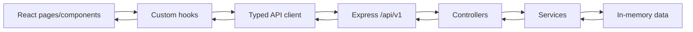

# Arquitectura de la aplicacion

## Frontend

El frontend esta organizado por responsabilidad:

- `src/components/`: componentes reutilizables.
- `src/pages/`: vistas conectadas a rutas.
- `src/hooks/`: hooks reutilizables.
- `src/context/`: estado global con Context API.
- `src/api/`: cliente tipado de red.
- `src/types/`: contratos TypeScript compartidos conceptualmente con la API.
- `src/utils/`: funciones auxiliares.

## Componentes principales

- `AppShell`: layout general y navegacion.
- `DestinationCard`: tarjeta reutilizable de destino.
- `ReservationForm`: formulario controlado para crear reservas.
- `ReservationList`: listado de solicitudes.
- `LoadingState` y `ErrorState`: estados de red reutilizables.

## Estado

Se usa `useState` para estado local de formularios, busqueda y datos cargados. Se usa `useEffect` para cargar informacion de la API. Se usa `useMemo` para filtros y presupuesto estimado. Se usa `useCallback` para funciones reutilizadas por componentes hijos.

Context API guarda el destino seleccionado y los favoritos, porque esos datos se consumen en varias zonas de la aplicacion.

## Backend/API

El backend usa Express y esta dividido en:

- `routes/`: define rutas HTTP.
- `controllers/`: traduce request/response y codigos HTTP.
- `services/`: contiene reglas de negocio.
- `config/`: datos iniciales en memoria.
- `types/`: interfaces del dominio.

## Recursos REST

- `GET /api/v1/destinations`: devuelve todos los destinos.
- `GET /api/v1/destinations/:id`: devuelve un destino.
- `GET /api/v1/reservations`: devuelve reservas.
- `POST /api/v1/reservations`: crea una reserva.
- `PATCH /api/v1/reservations/:id`: cambia estado de reserva.
- `DELETE /api/v1/reservations/:id`: elimina una reserva.

## Persistencia

Los destinos y reservas viven en memoria en el backend. La UI no usa LocalStorage para estos datos, porque la API es la fuente de verdad. El estado de favoritos vive solo en cliente porque es una preferencia temporal de usuario.

## Flujo de datos

