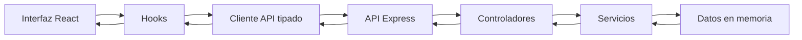

# Arquitectura de la aplicación

## Estructura general

La aplicación está dividida en dos partes principales: frontend y backend. El frontend se encarga de la interfaz que ve el usuario, y el backend expone la API con los datos de destinos y reservas.

He intentado que cada carpeta tenga una responsabilidad clara para que el proyecto sea más fácil de entender y mantener.

## Frontend

La estructura principal del frontend es:

- `src/components/`: componentes reutilizables.
- `src/pages/`: páginas principales de la web.
- `src/hooks/`: hooks personalizados.
- `src/context/`: estados globales compartidos.
- `src/api/`: cliente de API.
- `src/types/`: tipos de TypeScript.
- `src/utils/`: funciones auxiliares.

## Componentes principales

- `AppShell`: estructura general de la página, cabecera y navegación.
- `DestinationCard`: tarjeta para mostrar un destino.
- `ReservationForm`: formulario para solicitar una reserva.
- `ReservationList`: listado de solicitudes de reserva.
- `LoadingState`: estado visual de carga.
- `ErrorState`: estado visual de error.
- `ParticleBackground`: fondo decorativo con partículas.

## Gestión del estado

Para estados locales uso `useState`, por ejemplo en formularios, búsquedas y mensajes. Para cargar datos de la API uso `useEffect`. También se usa `useMemo` para cálculos como el presupuesto estimado y `useCallback` para funciones que se pasan a otros componentes.

Para estados compartidos se usa Context API. Hay un contexto para reservas/favoritos y otro para el tema claro u oscuro.

## Backend

El backend está hecho con Express y sigue una arquitectura por capas:

- `routes/`: define las rutas.
- `controllers/`: gestiona las peticiones y respuestas.
- `services/`: contiene la lógica principal.
- `config/`: guarda los datos iniciales.
- `types/`: define los tipos del backend.

Esta separación ayuda a que el código no esté todo mezclado en un solo archivo.

## Endpoints REST

- `GET /api/v1/destinations`: devuelve todos los destinos.
- `GET /api/v1/destinations/:id`: devuelve un destino concreto.
- `GET /api/v1/reservations`: devuelve las reservas.
- `POST /api/v1/reservations`: crea una reserva.
- `PATCH /api/v1/reservations/:id`: actualiza el estado de una reserva.
- `DELETE /api/v1/reservations/:id`: elimina una reserva.

## Persistencia de datos

En este proyecto los datos están en memoria en el backend. Esto significa que no hay base de datos real. Para el objetivo del trabajo es suficiente, porque permite demostrar la conexión entre frontend, API y backend.

Los favoritos y el modo claro/oscuro son preferencias de interfaz. Por eso se gestionan desde el cliente.

## Flujo de datos

